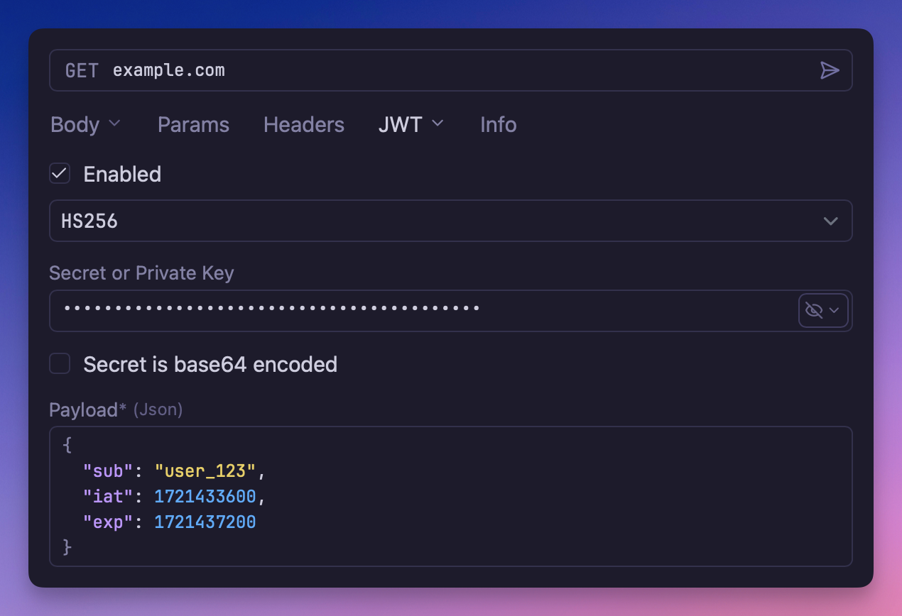

# JSON Web Token (JWT) Authentication

A [JSON Web Token](https://datatracker.ietf.org/doc/html/rfc7519) (JWT) authentication
plugin that supports token generation, signing, and automatic header management.



## Overview

This plugin provides JWT authentication support for API requests. JWT is a compact,
URL-safe means of representing claims between two parties, commonly used for
authentication and information exchange in modern web applications and APIs.

## How JWT Authentication Works

JWT authentication involves creating a signed token containing claims about the user or
application. The token is sent in the `Authorization` header:

```
Authorization: Bearer <jwt-token>
```

A JWT consists of three parts separated by dots:

- **Header**: Contains the token type and signing algorithm
- **Payload**: Contains the claims (user data, permissions, expiration, etc.)
- **Signature**: Ensures the token hasn't been tampered with

## Usage

1. Configure the request, folder, or workspace to use JWT Authentication
2. Set up your signing algorithm and secret/key
3. Add custom JWT header fields if needed
4. Configure the required claims for your JWT payload
5. The plugin will generate, sign, and include the JWT in your requests

## Common Use Cases

JWT authentication is commonly used for:

- **Microservices Authentication**: Service-to-service communication
- **API Gateway Integration**: Authenticating with API gateways
- **Single Sign-On (SSO)**: Sharing authentication across applications
- **Stateless Authentication**: No server-side session storage required
- **Mobile App APIs**: Secure authentication for mobile applications
- **Third-party Integrations**: Authenticating with external services

## Troubleshooting

- **Invalid Signature**: Check your secret/key and algorithm configuration
- **Token Expired**: Verify expiration time settings
- **Invalid Claims**: Ensure required claims are properly configured
- **Algorithm Mismatch**: Verify the algorithm matches what the API expects
- **Key Format Issues**: Ensure RSA keys are in the correct PEM format
